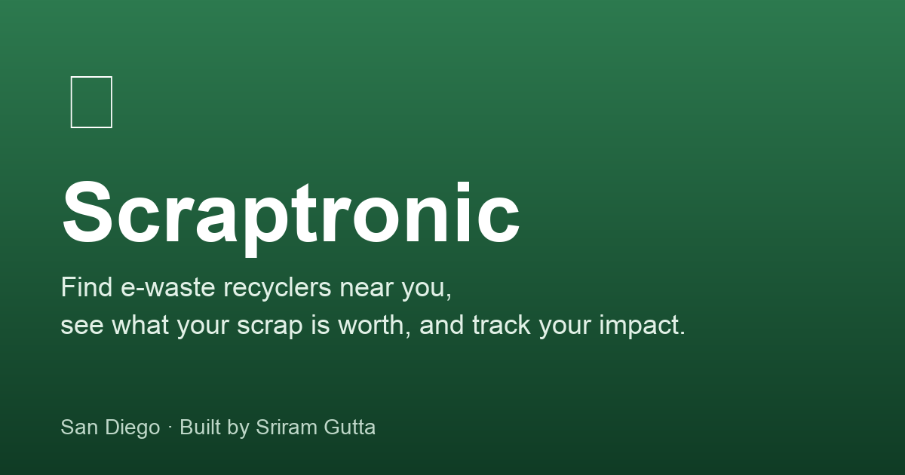

# ♻ Scraptronic

> Find local e-waste recyclers, see what your old electronics are worth in raw materials, and track the impact of recycling them. San Diego focused. Built on public data.

🌐 **Live app:** **https://sriram-gutta.github.io/scraptronic/**
🔌 **Backend API:** https://sriramgutta.pythonanywhere.com/api/health
🧰 **Repo:** https://github.com/Sriram-Gutta/scraptronic



---

## What it does

| Page | What you get |
|---|---|
| **Map** | A Leaflet map of 30 hand-curated San Diego e-waste drop-offs. Click a marker for hours, phone, what they accept, and the public registry the entry came from. |
| **Materials** | A catalog of 10 common e-waste materials with regional scrap prices (aluminum, copper, brass, circuit boards, lithium batteries, hard drives, CRT glass, and more). Calculator widget turns *"5 lbs of copper"* into a $ estimate. |
| **My Recycling** | A personal tracker backed by browser `localStorage`. Log entries, see running totals, progress through tiers, and watch estimated CO₂ savings add up using EPA WARM factors. No signup. |
| **Learn** | Five short articles (300–500 words each) on the e-waste problem, how recycling actually works, the gold in your old laptop, and how to prep devices for drop-off. Every claim cites a source. |

## Why I built it

I'm a computer engineering student from San Diego with a drawer of dead phones, old laptop chargers, and a defunct external hard drive. Figuring out how to actually recycle them properly took me an embarrassing amount of digging — the info is scattered across CalRecycle, the City of San Diego HHW page, individual recycler websites, Earth911, and a handful of nonprofits. Scraptronic is my attempt to bundle that scattered information into one place, focused on San Diego to start, with honest sourcing on every entry.

## Stack

| Layer | Choice |
|---|---|
| Frontend | Vanilla **HTML + CSS + JavaScript** + [Leaflet](https://leafletjs.com/) for mapping. No build step. |
| Backend | Python **Flask** + Flask-CORS. One file (`backend/app.py`) for the whole API. |
| Data | Hand-curated JSON files in `/data` (`recyclers.json`, `materials.json`, `articles.json`). Single source of truth. |
| Storage | Browser `localStorage` for user state. No database, no auth. |
| Hosting | **GitHub Pages** for the frontend (auto-deploy via GitHub Actions workflow). **PythonAnywhere** free tier for the backend. Both free, both always-on. |
| Geocoding | [Nominatim](https://nominatim.openstreetmap.org/) for one-time address → coordinate lookup, with the required 1 req/sec politeness throttle. |

## Repo layout

```
scraptronic/
├── frontend/             # static site → GitHub Pages
│   ├── index.html, map.html, materials.html, tracker.html,
│   │   learn.html, learn-article.html, about.html
│   ├── css/style.css
│   ├── js/
│   │   ├── config.js          # picks BACKEND_URL based on hostname
│   │   ├── map.js             # Leaflet + sidebar
│   │   ├── materials.js       # cards + calculator
│   │   ├── tracker.js         # points/tier/CO2 math + localStorage
│   │   └── learn.js           # tiny markdown renderer + article view
│   ├── favicon.svg
│   └── img/
│       ├── og-image.png       # social preview card
│       └── make_og_image.py   # Pillow script that builds it
├── backend/              # Flask API → PythonAnywhere
│   ├── app.py            # all routes, ~250 lines, top to bottom
│   ├── wsgi.py           # PythonAnywhere entry point
│   └── requirements.txt  # flask, flask-cors
├── data/                 # JSON, loaded once at backend startup
│   ├── recyclers.json    # 30 entries, each with a `source` field
│   ├── materials.json    # 10 materials with price + source citations
│   ├── articles.json     # 5 markdown articles + sources arrays
│   └── build_recyclers.py # Nominatim geocoder for the recycler list
├── .github/workflows/
│   └── deploy-frontend.yml # publishes /frontend (and /data fallback)
├── LICENSE
└── README.md
```

## API

All endpoints live under `/api`. Available at https://sriramgutta.pythonanywhere.com:

```
GET  /api/health                        # status + loaded counts
GET  /api/recyclers[?material=<slug>]   # all 30, or filtered by accepted material
GET  /api/recyclers/<id>                # one recycler, full detail
GET  /api/materials                     # all 10 materials
GET  /api/materials/<slug>              # one material
POST /api/materials/estimate            # body {material, lbs} → $ estimate + range
GET  /api/articles                      # summaries (no body)
GET  /api/articles/<slug>               # full article + sources
```

Every frontend page falls back to the corresponding static JSON from GitHub Pages if the backend is unreachable, so the site keeps working even when the API is sleeping.

## Running locally

### Frontend
```bash
cd frontend
python3 -m http.server 8000
# open http://127.0.0.1:8000/
```
`js/config.js` automatically points at `127.0.0.1:5000` when loaded from `localhost`, so the two halves talk to each other with no extra setup.

### Backend
```bash
cd backend
python3 -m venv .venv && source .venv/bin/activate
pip install -r requirements.txt
python app.py
# check http://127.0.0.1:5000/api/health
```

## Data sources

| Source | Used for |
|---|---|
| [CalRecycle CEW participant directory](https://www2.calrecycle.ca.gov/electronics/eRecycle/) | Approved-collector verification (San Diego E-Waste CEWID 116525, etc.) |
| [CalRecycle SB 20 program rate schedule](https://www2.calrecycle.ca.gov/Docs/Web/132126) | CRT glass disposal rate (~$0.85/lb) |
| [Urban Corps of San Diego County](https://urbancorpssd.org/ewaste/) | Two recycler entries + partner site |
| [City of San Diego HHW](https://www.sandiego.gov/environmental-services/ep/hazardous) | Context (City facility does *not* accept e-waste) |
| [EPA SMM Electronics](https://www.epa.gov/smm-electronics) | Article sourcing |
| [EPA WARM model v15](https://www.epa.gov/sites/default/files/2020-12/documents/warm_electronics_v15_10-29-2020.pdf) | CO₂ savings factors in the tracker |
| [UN Global E-Waste Monitor 2024](https://ewastemonitor.info/the-global-e-waste-monitor-2024/) | Article stats (62B kg generated, 22.3% recycled) |
| [ScrapMonster](https://www.scrapmonster.com/scrap-yards/prices/san-diego/12) + [iScrap App](https://iscrapapp.com/metals/hard-drives/) | Regional scrap prices |
| [Specialty Metals](https://www.specialtymetals.com/smelting-refining/electronics-circuit-boards) + [Boardsort](https://boardsort.com/payout.php) | Circuit board / precious metal recovery figures |
| [NIST SP 800-88 r1](https://nvlpubs.nist.gov/nistpubs/SpecialPublications/NIST.SP.800-88r1.pdf) | Data sanitization references in the prep article |

Each `recyclers.json` and `materials.json` entry carries its own `source` field with the URL and retrieval date.

## What's honest about this demo

Scraptronic surfaces the **estimated** scrap value of materials based on publicly available regional prices. **Users are paid by the recycling centers themselves, not by this site.** A production version of Scraptronic would partner with recyclers to facilitate payouts and take a small transaction fee; this version focuses on **discovery, education, and progress tracking**.

A few more honest disclosures:

- **Scrap prices fluctuate weekly.** Every number is an estimate based on a sourced regional average and the sample date is shown on the card. Real payouts vary by recycler, load size, and what mood the buyer's in that day.
- **Recycler hours and phone numbers go stale.** Each entry shows when it was last verified. Call ahead before you drive out.
- **The CO₂-saved figures are approximations** derived from EPA WARM v15 factors. They're directionally honest but not a carbon credit.
- **Circuit board gold "yield" is informational, not a calculator entry.** You can't and shouldn't try to extract gold from boards at home — the article explains why.

## What I'd build next

- **Real recycler partnerships** with payout intermediation and a transaction fee model.
- **User accounts** (Postgres + JWT) so you can carry your history across devices.
- **Drop-off scheduling** and route optimization for businesses with bulk e-waste.
- **Geographic expansion** — California first (Oakland and LA have similar fragmented infrastructure), then nationwide.
- **A PWA build** so the tracker works offline on your phone at the recycler.

## Tech choices I made (and why)

- **PythonAnywhere over Vercel for the Flask backend.** Vercel's Python serverless cold starts (1–3s per endpoint) hurt the map page's first impression. PythonAnywhere's free tier is always-on, slower per-request but never cold.
- **GitHub Actions workflow to deploy from `/frontend`.** GitHub Pages only supports `/` or `/docs` as a source folder; a workflow lets the actual frontend code live under `frontend/` (clearer than calling app code "docs") while still publishing static `/data/*.json` alongside it for the fallback path.
- **No build step, no framework.** Plain HTML/CSS/JS keeps the page source readable in `View Source`, the repo is approachable for anyone curious to fork it, and the architecture has no opinions about JavaScript fashion that'll age in a year.
- **localStorage instead of a real database.** Removed every reason to add auth, removed every reason to think about per-user privacy, and kept the project inside free hosting comfortably. The tracker even ships with an "Export my data" button so users can take it with them.
- **Per-record `source` fields** in `recyclers.json` and `materials.json` instead of one big "credits" section. Makes the data file the source of truth for both the page AND the citation, and means anyone forking the repo can audit a single entry without reading the README.

## License

MIT — see [LICENSE](LICENSE).
